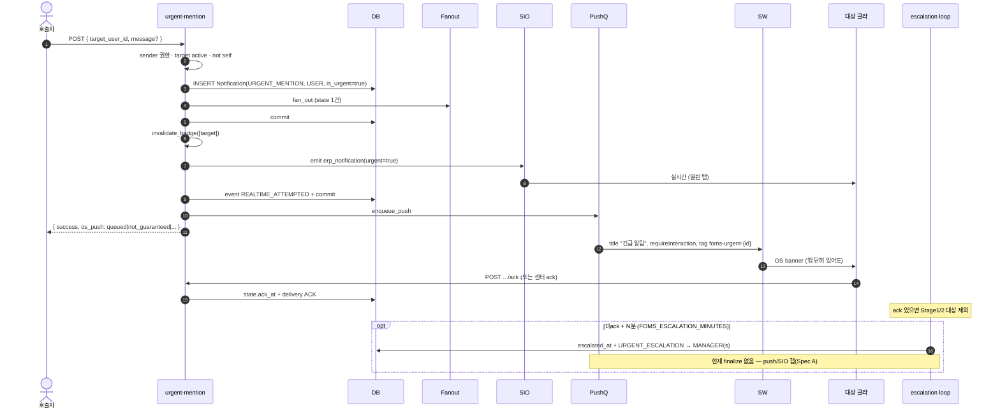
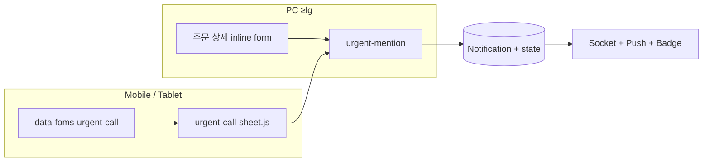
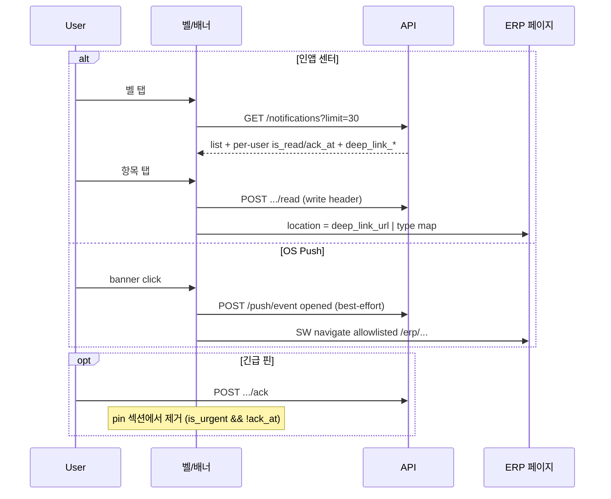

# 알림 E2E 시퀀스 — DRAWING_* / URGENT_MENTION
> 작성일: 2026-07-16 | 상태: 📖 참조(분석 산출)  
> 코드 정본: `erp_orders_drawing.py` · `erp_orders_revision.py` · `drawing_order_change.py` · `foms/api/notifications/__init__.py`

---

## 공통 범례

| 참가자 | 역할 |
|--------|------|
| Actor | 행위 사용자(도면팀/영업/호출자) |
| API | Flask route |
| DB | `notifications` + `notification_user_states` + events |
| Fanout | `fan_out_new_notification` |
| PushQ | `enqueue_push_for_notification` → RQ → `push_sender` |
| SIO | `emit_erp_notification_to_users` → room `user_{id}` |
| SW | Service Worker `push` / `notificationclick` |
| Client | 열린 탭(badge/socket) 또는 OS banner |

---

## 1. DRAWING_TRANSFERRED (도면 전달)

**트리거:** `POST .../transfer-drawing` (또는 동일 헬퍼)  
**대상:** 담당자 규칙 — 라홈→`CS`, 하우드→`HAUDD`, 그 외→`SALES`(+ `target_manager_name`)  
**P1 push:** ✅ (`DRAWING_TRANSFERRED` ∈ `_DEFAULT_P1_TYPES`)  
**Deep link:** workbench `?tab=timeline` (+ history event_id 가능)

```mermaid
sequenceDiagram
  autonumber
  actor Actor as 도면 담당
  participant API as transfer-drawing
  participant DB
  participant Fanout
  participant PushQ as RQ/pywebpush
  participant SIO as Socket.IO
  participant SW
  participant Client as 수신자 클라

  Actor->>API: POST transfer-drawing (files/note)
  API->>DB: Order.structured_data 전달 이력 + drawing_status
  API->>DB: INSERT Notification(type=DRAWING_TRANSFERRED, team/manager)
  API->>Fanout: fan_out_new_notification
  Fanout->>DB: user_states + event created
  API->>DB: commit
  API->>API: invalidate dashboard DRAWING/ORDERS
  API->>PushQ: enqueue_push(notification_id)
  API->>API: resolve_recipient_user_ids(team/manager, include_admin)
  API->>API: invalidate_badge_cache(recipients)
  API->>SIO: emit erp_notification(recipients)
  SIO->>Client: room user_N (열린 탭)
  Client->>Client: onErpNotification → badge refresh
  PushQ->>DB: 구독 재조회 (pending states)
  PushQ->>SW: Web Push (generic title "도면 알림")
  SW->>Client: showNotification
  Client->>SW: notificationclick
  SW->>Client: navigate /erp/drawing-workbench/{oid}?tab=timeline
  Note over Client: 또는 센터에서 탭→read→동일 deep_link
```

**수신자 resolve 메모:** fanout은 `target_team` / `target_manager_name` 활성 유저. emit 쪽 `include_admin=True`라 **ADMIN은 realtime/badge 경로에 포함될 수 있으나**, fanout state는 ADMIN 자동 생성 안 함(직접 팀/이름 매칭 시에만 inbox). ADMIN이 팀에 속하지 않으면 **배지·리스트에 안 보이는데 socket만 오는** 비대칭 가능 → 센터 통합 시 관측 포인트.

---

## 2. DRAWING_REVISION (도면 수정 요청)

**트리거:** revision API (`REQUEST_REVISION` history)  
**대상:** `target_team='DRAWING'`  
**P1 push:** ✅  
**Deep link:** workbench `?tab=requests`

```mermaid
sequenceDiagram
  autonumber
  actor Actor as 영업/CS 등
  participant API as request-revision
  participant DB
  participant Fanout
  participant PushQ
  participant SIO
  participant SW
  participant Client as 도면팀 클라

  Actor->>API: POST revision (note, files, target drawings)
  API->>DB: drawing_transfer_history += REQUEST_REVISION
  API->>DB: INSERT Notification(DRAWING_REVISION, team=DRAWING)
  API->>Fanout: fan_out_new_notification
  Fanout->>DB: states + created events
  API->>DB: commit
  API->>PushQ: enqueue_push
  API->>API: resolve recipients(DRAWING) + badge invalidate
  API->>SIO: emit erp_notification
  SIO->>Client: 실시간 배지/토스트
  PushQ->>SW: generic "도면 알림"
  SW->>Client: click → /erp/drawing-workbench/{oid}?tab=requests
```

---

## 3. ERP_ORDER_CHANGED (주문 내용 변경 → 도면 확인)

**트리거:** `apply_drawing_order_change_alert` + commit 후 `finalize_drawing_order_change_alert`  
**대상:** `DRAWING` 팀  
**Debounce:** 같은 알림 merge 시 `created_new=False` → **OS push 생략**, badge+realtime은 유지

```mermaid
sequenceDiagram
  autonumber
  actor Actor as 주문 편집자
  participant Svc as drawing_order_change
  participant DB
  participant Fanout
  participant Fin as finalize_*
  participant PushQ
  participant SIO
  participant Client

  Actor->>Svc: 주문 필드 변경 (watch paths)
  alt 신규 알림
    Svc->>DB: history ERP_ORDER_CHANGED + pending flag
    Svc->>DB: INSERT Notification(ERP_ORDER_CHANGED)
    Svc->>Fanout: fan_out
    Note over Svc: 호출부 commit
    Svc->>Fin: finalize(created_new=true)
    Fin->>PushQ: enqueue_push
  else debounce merge
    Svc->>DB: 기존 notif title/message 갱신
    Note over Svc: 호출부 commit
    Svc->>Fin: finalize(created_new=false)
    Note over PushQ: push 생략
  end
  Fin->>Fin: badge invalidate(DRAWING+admin resolve)
  Fin->>SIO: emit
  SIO->>Client: inbox/badge 즉시 갱신
  PushQ-->>Client: (신규만) OS banner → workbench?tab=timeline
```

---

## 4. URGENT_MENTION (긴급 호출)

**트리거:** `POST /erp/api/orders/{id}/urgent-mention`  
**Sender 게이트:** 주문 관련자 | ADMIN | MANAGER  
**Target 게이트:** 활성 유저면 OK (자기 자신 제외)  
**P0 push:** `is_urgent=True` → severity 항상  
**Ack:** pin 해제 / escalation 중단 조건



### 디바이스별 송신 UI (수신 시퀀스와 별개)



---

## 5. 수신 측 공통 (센터 / Push 클릭)



---

## 6. 타입 비교 표

| | TRANSFERRED | REVISION | ORDER_CHANGED | URGENT_MENTION |
|--|-------------|----------|---------------|----------------|
| team/user | CS/HAUDD/SALES(+name) | DRAWING | DRAWING | target_user_id |
| is_urgent | false | false | false | **true** |
| Push | P1 | P1 | P1 (신규만) | P0 always |
| Realtime | ✅ | ✅ | ✅ (merge도) | ✅ |
| Deep tab | timeline | requests | timeline | 주문 상세/edit |
| Escalation | — | — | — | 미ack 시 Stage1/2 |

---

## 7. 수동 검증 체크리스트 (스테이징)

- [ ] 도면 전달 → 영업/CS 탭 badge + (구독 시) OS "도면 알림" → 클릭 시 workbench timeline
- [ ] 수정 요청 → 도면팀 → workbench requests
- [ ] 주문 변경 연속 저장 → push 1회만, realtime/badge는 merge마다
- [ ] 긴급 멘션 → 대상 OS "긴급 알림" + `os_push=queued` → ack 후 핀 해제·escalation 미발생
- [ ] 미ack 방치 → Stage1 매니저 inbox row 존재 (push는 Spec A 승인 전 기대하지 말 것)

형제: Spec A `2026-07-16-notification-escalation-push-realtime_SPEC.md` · Scope B `2026-07-16-notification-center-unify-refactor-scope.md`
