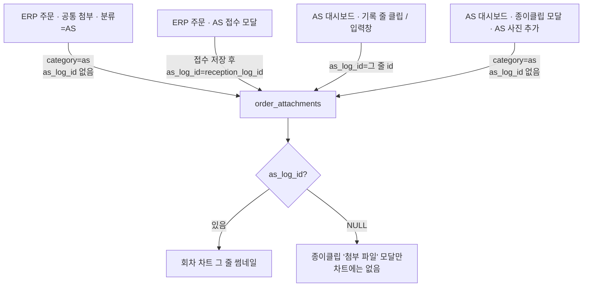

# ERP 공통첨부(AS) → 회차 차트 결합 + ERP AS PUSH 확인창 (AS-BIND-01)

- 작성: 2026-08-20
- 상태: **✅ 완료**
- 선행: AS-FRESH-01 (`2026-08-13-as-attachment-freshness_SPEC.md`), AS-SORT-01 (`2026-08-19-as-attachment-sort-order_SPEC.md`)
- 선행: AS-FRESH-01 (`2026-08-13-as-attachment-freshness_SPEC.md`), AS-SORT-01 (`2026-08-19-as-attachment-sort-order_SPEC.md`)
- 사용자 결정(2026-08-20, 조사 후 → 페르소나 시뮬레이션 반영):
  1. ERP 주문 **공통 첨부 → AS**로 올린 파일이 AS 대시보드 회차 차트에 보여야 한다.
  2. ERP 주문에서 채널톡 AS PUSH를 할 때도 대시보드처럼 **확인창 + 지정 순서**로 보낸다.
  3. 접수 **전**에 올린 사진은 임시 `첨부 파일` 메모에 두고, **나중에 AS 접수하면 접수 줄로 옮긴다**.
  4. 방안/통화 등 **다른 기록 줄에 붙이지 않는다**(시뮬레이션: 직원이 접수 칸만 보고 “사진 없음”이라고 판단함).

---

## 0. 지금 워크플로 (조사 결과, 코드 기준)

이 절은 구현이 아니라 **현상**. 고칠 계약은 §1부터.

### 0.1 업로드 표면 세 갈래

정본 필터는 `_as_attachments_by_log_id` (`foms/web/cs/as_dashboard.py`): `category='as'` **그리고** `as_log_id IS NOT NULL`. 주석 그대로 *「결합되지 않은 첨부는 기존 첨부 모달 소관」*.

그래서 **공통 첨부 AS 업로드 = 차트에 안 보임**은 버그라기보다 AS-FRESH-01의 설계다. 직원이 기대하는 화면(차트)과 실제 소관(종이클립 모달)이 다르다. 종이클립 버튼 색(`has_as_photos`)은 `category='as'`만 보므로, 파일은 있는데 차트만 빈 것처럼 보인다.

### 0.2 PUSH 두 갈래

| 출발 | 확인창 | `attachment_ids` | 서버가 쓰는 순서 |
|------|--------|------------------|------------------|
| **AS 대시보드** | `GET /api/channel/push-preview` → 스트립에서 빼기/순서 | **보낸다** (DOM 순서) | 배열 그대로 (`dto.files`) |
| **ERP 주문 PUSH** | 종류 시트 + 재전송 note만. **파일 확인 없음** | **안 보낸다** | `select_as_push_attachments` → `sort_order` |

`select_as_push_attachments` 3단 (AS-FRESH, 유지):

1. **현재 회차에 결합된** 첨부만.
2. 1이 비면: 마지막 PUSH `max_attachment_id`보다 **큰 id**(미발송 델타). 여기 미결합 파일이 들어온다.
3. 둘 다 비면: 그 주문 AS 첨부 최신 N장.

1단에 접수 사진이 하나라도 있으면 **미결합(공통 첨부 AS)은 PUSH에서 빠진다.** 차트에 안 보이는 것과 같은 축이다.

대시보드에서 썸네일을 옮겨 저장한 `sort_order`는, ERP PUSH가 `attachment_ids`를 안 보내도 **1단에 뽑힌 파일끼리**는 그 순서로 나간다. 확인창에서만 바꾼 순서(저장 안 함)는 ERP PUSH에 전달되지 않는다.

### 0.3 차트에서 직원이 사진을 찾는 위치 (시뮬레이션 핵심)

회차 차트는 기록을 한 줄로 안 쌓는다.

- **맨 아래 `접수` 칸** = `as_log`에서 **첫 번째** `reception`만 (`as_round_chart.py`: `reception is None`일 때만 캡처). 직원이 “AS 사진”을 보는 자리.
- **회차 표** = 방안/통화/자재/메모/`reception`이 아닌 것. 첫 접수는 여기 **안** 들어간다.
- 2회차 재접수의 새 `reception`은 첫 번째가 아니므로 회차 표에 들어간다.

그래서 공통 첨부 AS를 “최근 방안 줄”에 붙이면, 접수 칸은 계속 비어 있고 현장은 다시 “대시보드에 파일이 안 보여”라고 본다. 앵커는 **현재 회차 reception**이거나, 그게 없을 때만 **주차 메모**다.

### 0.4 이번 스펙이 닫는 구멍

- 공통 첨부 AS(그리고 같은 구멍인 대시보드 종이클립 업로드) → 현재 회차 **접수 줄**(없으면 주차 메모)에 결합 → 차트에 보임 + 1단 PUSH에 포함.
- 주차 메모 → **접수 시 접수 줄로 재결합**, 빈 주차 줄은 soft-delete.
- ERP AS PUSH → 대시보드와 **같은 확인창 계약**.

---

## 1. What — 무엇을 만드는가

### 1.1 최종 결과물

1. ERP 주문에서 분류 AS로 파일을 올리면, 다음 대시보드 로드에 **접수 칸**(접수가 있으면) 또는 **임시 `첨부 파일` 줄**(접수가 없으면)에 썸네일이 붙는다. 종이클립 모달에만 숨지 않는다.
2. 그 줄에서 ▲▼/드래그로 정한 순서가 다음 AS PUSH의 **기본 선택 순서**다.
3. 사진만 먼저 올리고 나중에 AS 접수하면, 임시 줄의 파일이 **접수 칸으로 옮겨지고** 임시 줄은 차트에서 사라진다.
4. ERP 주문에서 AS PUSH를 누르면 대시보드와 같이 **본문 + 파일 스트립**이 뜨고, 거기서 정한 순서가 채널톡 첨부 순서다.

### 1.2 기능 요구사항

**A. 암시적 결합 앵커 (서버 SSOT)**

`category='as'` 업로드인데 클라이언트가 `as_log_id`를 **안 보냈거나 빈 값**이면, 서버가 아래 순서로 한 개 앵커를 정해 결합한다. 클라이언트가 **유효한** `as_log_id`를 보낸 경로(접수 모달·클립·dock)는 **그대로** — 덮지 않는다.

앵커 (`resolve_as_upload_anchor(order, user) -> as_log_id`). **2순위(최근 방안/통화)는 없다.**

1. 현재 회차(`current_as_round`)의 **삭제되지 않은 `reception`** 중 가장 최근(리스트 뒤).  
   **전역 첫 접수 id를 쓰면 안 된다.** 2회차 사진을 1회차 맨 아래 접수 칸에 섞는다.
2. 1이 없으면, 현재 회차의 삭제되지 않은 **주차 메모**(`as_upload_park === true`) 하나. 본문을 직원이 고쳐도 플래그로 찾는다.
3. 그것도 없으면 **한 번만** 현재 회차에 memo를 append. 표시 본문 `첨부 파일`, `as_upload_park: true`, `by`/`by_id` = 업로드한 직원.

3번은 병렬 complete가 메모를 N개 만들지 않게 **`pg_advisory_xact_lock(order_id)` 안에서 재조회 후 append**.

배치 UX: 클라가 먼저 `POST /api/orders/<id>/as/upload-anchor`를 한 번 호출해 `{as_log_id, next_sort_order}`를 받고, 배치에 `asLogId` + `sortOrders: next+i`를 실어 보낸다. 이 호출이 실패하면 **업로드를 시작하지 않는다**(미결합으로 조용히 떨어지지 않음). 서버 업로드 경로도 빈 `as_log_id`면 같은 헬퍼를 탄다(구 클라·종이클립 폴백).

`next_sort_order` = 그 앵커 그룹의 `next_attachment_sort_order`. 기존 사진 뒤에 이어 붙인다. `0..n-1`로 덮어 기존 순서를 리셋하지 않는다.

**A2. 접수 시 주차 → 접수 줄 (park-then-move)**

`api_as_register`가 `reception_log_id`를 확보한 **같은 트랜잭션**에서:

1. 현재 회차(접수 항목의 `round`)의 삭제되지 않은 주차 메모를 찾는다. (`as_upload_park`, 본문 문자열 매칭 금지)
2. 그 메모들에 결합된 살아 있는 AS 첨부를 `sort_order` 순으로 읽어, 접수 그룹의 `next_attachment_sort_order`부터 이어 붙이며 `as_log_id`를 접수 id로 바꾼다.
3. 주차 메모는 기존 as_log 삭제와 같이 `deleted=true` (+ `deleted_at`/`deleted_by`=시스템 또는 접수한 직원). 차트에 빈 `첨부 파일` 줄이 남지 않게 한다.
4. `reception_log_id`가 없는 접수(원문 없이 system만)면 **옮기지 않는다.** 주차 줄에 그대로 둔다. 이후 원문 있는 접수/재접수에서 다시 시도한다.

레거시 `as_log_id IS NULL` 파일은 이 이동에 **넣지 않는다** (AS-FRESH 소급 배정 금지).

직원이 주차 메모를 수동 삭제하면 그 파일은 삭제된 기록에 묶인 채로 차트에서 사라진다(기존 기록 삭제와 동일). 다음 업로드는 새 주차 메모를 만든다. 수동 삭제분을 접수 때 되살리지는 않는다.

**B. 적용 표면 (같은 구멍은 같이 막는다)**

| 표면 | 지금 | 이번 |
|------|------|------|
| ERP `#erp-attachments-category` = AS | `as_log_id` 없음 | 업로드 전 upload-anchor → 배치에 결합 |
| AS 대시보드 종이클립 「AS 사진 추가」 | 동일 구멍 | 동일 (서버 폴백만으로도 닫히지만 클라도 앵커+sortOrders) |
| ERP AS 접수 모달 | 이미 reception에 결합 | 업로드 결합은 그대로. **register가 주차 파일을 접수 줄로 이동** |
| 대시보드 클립 / dock | 이미 그 줄에 결합 | **변경 없음** |

**C. ERP AS PUSH 확인창**

`erpRunChannelPush(..., 'as')`는 곧바로 `push-manual`하지 않는다.

1. (기존) dirty 저장 확인, 재전송이면 change_note. 재전송 note UX는 지금 ERP 모달을 유지해도 되고, 확인창 전송 실패 시 대시보드처럼 prompt 폴백해도 된다. **파일 확인 전에 note를 받는 현재 순서를 유지**해도 계약은 성립한다.
2. `GET /api/channel/push-preview?order_id=&push_kind=as` (이미 있는 API, 선정 함수 동일).
3. 대시보드와 **같은 마크업·같은 JS**로 확인창. 전송 시 `attachment_ids` = 선택 스트립 DOM 순서.
4. 서버 계약은 AS-SORT-01 그대로: 배열 순서 = `dto.files`. `sorted()` 금지.

확인창을 ERP 주문 페이지에 복제하지 않는다. partial + 모듈을 대시보드와 공유한다.

실측/도면/견적 PUSH는 이번 범위 밖(즉시 전송 유지).

### 1.3 예외 / 비목표

- **이미 올라간 미결합 파일의 자동 소급 배정 금지.** AS-FRESH-01과 같다. 3개월 전 공통 첨부 사진을 지금 접수 줄에 붙이면 오귀속이다. 종이클립 모달에 남는다. (후속: 모달에서 「현재 회차에 붙이기」 수동 버튼 — 이번 필수 아님)
- AS-FRESH 3단 선정 공식 변경 금지. 결합되면 자연히 1단에 들어온다.
- `as_log` JSONB에 파일 목록 복제 금지.
- 실측/도면/시공 공통 첨부를 AS 차트에 넣지 않는다. `category='as'`만.
- 채널톡 transport / `apply_attachment_policy` 변경 금지.
- 마이그레이션 없음 (`as_log_id`·`sort_order` 이미 있음).
- `system` 항목에 파일을 붙이지 않는다(차트 스트림에서 상태 카드로 흡수됨 → 썸네일이 사라짐).
- 명시적 `as_log_id`가 **존재하지 않는 id**면 지금처럼 400. 빈 값만 앵커로 치환.
- 전역 첫 `reception`을 현재 회차 앵커로 쓰지 않는다(2회차 혼입).
- 주차 메모를 방안/통화/일반 메모와 섞어 앵커로 쓰지 않는다. 플래그 없는 메모는 무시.

---

## 2. How — 어떻게 만드는가

### 2.1 아키텍처

- 결합 판정은 **서버 한 함수**. JS가 회차/reception id를 추측하지 않는다.
- 주차→접수 이동도 **서버**. 접수 모달 JS가 첨부 id를 다시 보내지 않는다.
- PUSH 확인창은 **한 모듈**. 대시보드 JS에서 확인창 블록을 옮기고 ERP는 그걸 호출만 한다. ERP 데스크탑·모바일 주문 레이아웃 **둘 다** partial을 include 한다.
- structured_data 수정은 기존 패턴: `deepcopy` + `flag_modified`. 주차 append와 접수 시 이동은 각 요청의 기존 sd 뮤테이션 tx에 넣는다.

참고 코드:

- 결합 검증: `foms/api/files/common.py` `resolve_as_log_ref`
- 회차: `foms/services/orders/as_log.py` `current_as_round` / `append_client_log`
- 업로드: `foms/api/files/order_routes.py`, `direct_upload.py`
- 차트 필터: `foms/web/cs/as_dashboard.py` `_as_attachments_by_log_id`
- PUSH: `foms/api/channel/channel_integration.py` explicit ids / `erpRunChannelPush` (`erp-order-shared.js`)
- 확인창: `templates/cs/partials/as_push_confirm_modal.html` + `static/js/cs/as-push-confirm.js` (대시보드·ERP 공용)

### 2.2 수정 대상 파일

| 파일 | 변경 |
|------|------|
| `foms/services/orders/as_upload_anchor.py` | **신규.** 앵커 해석 + 주차 memo append + `promote_parked_as_attachments` |
| `foms/api/files/common.py` | 빈 `as_log_id` + category as → 앵커. 명시 id는 기존 검증 |
| `foms/api/cs/as_orders.py` | `POST .../as/upload-anchor`. **register가 reception_log_id 확보 후 promote** |
| `foms/api/files/order_routes.py` / `direct_upload.py` | complete/form이 빈 결합을 앵커로 |
| `static/js/orders/erp-order-shared.js` | `erpUploadCommonAttachmentFiles`: category as일 때 앵커+sortOrders. `erpRunChannelPush('as')`: preview 확인창 |
| `static/js/cs/as-dashboard.js` | 종이클립 업로드에 앵커. 확인창 로직을 모듈로 이전 후 호출만 |
| `static/js/cs/as-push-confirm.js` | **신규.** preview 렌더·스트립·send. G4 `window.__AS_PUSH_CONFIRM_BOUND` |
| `templates/cs/partials/as_push_confirm_modal.html` | **신규.** 기존 모달 마크업 이동 |
| `templates/cs/partials/as_dashboard_body.html` | include로 교체 |
| ERP 주문 템플릿(데스크탑+모바일, 확인창이 실제로 뜨는 레이아웃) | 같은 partial include + `as-push-confirm.js` defer 핀 |
| `static/js/runtime/upload-progress.js` | 변경 최소. 이미 `asLogId`/`sortOrders` 있음 |
| `tests/domains/test_as_log_attachments.py` | 빈 as_log_id → **현재 회차** reception / 없으면 park 1건 / 방안만 있어도 park(방안 줄에 안 붙음) / 명시 id 우선 / 2회차는 1회차 접수에 안 붙음 |
| `tests/domains/test_as_register*.py` 또는 동 파일 | 주차 3장 → register → 접수 id로 재결합, park 메모 deleted, 레거시 NULL은 그대로 |
| `tests/domains/test_channel_integration_smoke.py` 또는 ERP push 클라 계약 | ERP 경로가 `attachment_ids`를 실어 보내는 것은 JS라 서버 테스트는 기존 explicit 순서 유지. 앵커 단위 테스트 필수 |

JS `?v=` 범프 + 핀 grep (AS-FRESH §5와 동일). 인라인 스타일·동기 script 금지.

### 2.3 의존성·영향

- DB 마이그레이션 **없음**.
- 첨부 업로드가 드물게 `as_log` memo를 append → JSONB 쓰기. 주문 뮤테이션 인벤토리(`foms_order_mutation_writer_inventory.json`)에 업로드 경로가 앵커 append를 타면 **재생성** (failopen 인벤토리 라인시프트 시 원격 tip 클린 worktree).
- 핫패스 리스트 쿼리 추가 없음. 업로드 1건당 로그 스캔은 메모리의 `as_log` 리스트.
- 성능: 업로드 전 앵커 RTT 1회. 배치 파일 수와 무관.

---

## 3. Steps — 실행 단계

승인 후에만 코딩한다.

- [x] **T1** `resolve_as_upload_anchor` + 락 + 계약 테스트 (현재 회차 reception / park 1건 / 방안 줄에 안 붙음 / 명시 id 우선 / 2회차 혼입 금지)
- [x] **T2** form·complete가 빈 결합을 앵커로. `POST .../as/upload-anchor`. 앵커 실패 시 클라 업로드 중단
- [x] **T3** `promote_parked_as_attachments`를 `api_as_register`에 연결. 주차→접수 테스트
- [x] **T4** ERP 공통 첨부 AS + 대시보드 종이클립 업로드가 앵커+sortOrders. 캐시 범프
- [x] **T5** 확인창 partial+모듈 추출. 대시보드 동작 회귀
- [x] **T6** ERP `pushKind==='as'`가 같은 확인창 + `attachment_ids`. 실측/도면 즉시 전송 유지. 모바일은 `erp_order_js.html` 1회 include (탭 이중 include는 id 중복)
- [x] **T7** `APP_OK`, 관련 pytest, 인벤토리 필요 시 재생성

---

## 4. 검증 기준

- [x] `python -c "import app; print('APP_OK')"` 성공
- [ ] AS 접수된 주문: ERP 공통 첨부 분류 AS로 3장 업로드 → 대시보드 **맨 아래 접수 칸** 썸네일 3장 (방안 줄이 아님)
- [ ] 접수 전 주문: 업로드 → 회차 표에 `첨부 파일` 주차 줄 **하나** + 파일. 방안만 있는 주문에 올려도 방안 줄에 안 붙음
- [ ] 위 주문에서 AS 접수(원문 있음) → 파일이 **접수 칸**으로 이동, 주차 줄 사라짐. 접수 모달에서 같이 올린 사진 **뒤**에 이어짐
- [ ] 원문 없는 접수(reception id 없음) → 주차 줄 유지. 이후 원문 접수에서 이동
- [ ] 2회차(미결 후) 공통 첨부 AS → **2회차 reception**(있으면) 또는 2회차 주차. 1회차 맨 아래 접수 칸에 안 섞임
- [ ] 접수 모달·클립은 기존처럼 **그 기록 id**에만 붙음 (앵커로 갈아타지 않음)
- [ ] 접수 줄에 사진이 있는 상태에서 공통 첨부 AS를 더 올림 → 같은 접수 줄 뒤에 이어짐. PUSH 기본 선택에 **방금 올린 장 포함** (1단)
- [ ] ERP AS PUSH → 확인창이 뜨고, 스트립을 2↔1로 바꾼 뒤 전송 → 채널톡 `files` 순서가 2,1
- [ ] 대시보드 AS PUSH 확인창 기존 동작 회귀. 실측/도면 PUSH는 확인창 없이 즉시
- [ ] 레거시 미결합 파일은 차트·접수 이동에 자동으로 안 붙음
- [ ] 인라인 스타일·동기 `<script>` 신규 없음

---

## 5. 참고 자료

- `docs/specs/2026-08-13-as-attachment-freshness_SPEC.md` §3.1 결합 축, §1.3 소급 배정 비목표
- `docs/specs/2026-08-19-as-attachment-sort-order_SPEC.md` §2.5 PUSH 배열 순서
- 차트 접수 칸 vs 회차 표: `foms/services/orders/as_round_chart.py` (`reception is None` 분기)
- 차트 제외 필터: `foms/web/cs/as_dashboard.py` `_as_attachments_by_log_id`
- ERP 공통 업로드: `static/js/orders/erp-order-shared.js` `erpUploadCommonAttachmentFiles` (AS면 `fomsEnsureAsUploadAnchor`)
- ERP PUSH: 같은 파일 `erpRunChannelPush('as')` → `fomsConfirmAndSendAsPush` (`attachment_ids` = 스트립 DOM 순서)
- 템플릿: `docs/guides/SPEC_TEMPLATE.md`
